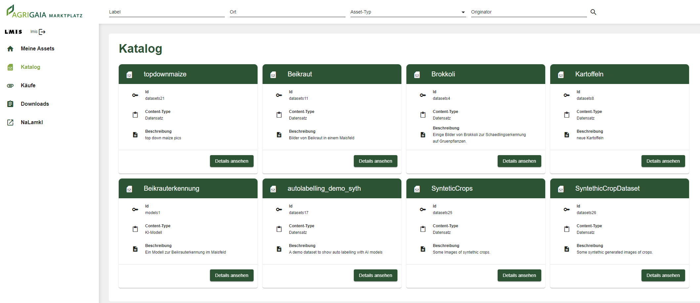

# Agri-Gaia Marketplace Dashboard

This repository represents a fork of the [EDC Data Dashboard](https://github.com/eclipse-edc/DataDashboard). In its current form, it contains the code for the Agri-Gaia Marketplace Dashboard. 



## Development Server

Run `ng serve` or `ng serve --configuration=local` for a dev server.

## Prerequisites

- Keycloak 

## Installation 

In the following we only describe the process for deploying the Dashboard on an OKD Cluster since this is what we did within the project. At the current state of the document, we have yet to implement the mechanism for dynamically mounting an environment file into the running Dashboard container. As a temporary solution, the idea is to create the environment file merely locally, build the Docker image based on the provided Dockerfile in the root directory and then push it to your OKD image registry.  

First things first, create a file `environment.local.ts`. It is supposed to contain the values needed for communicating with Keycloak and with the Agri-Gaia Marketplace Services, which you can find more information about [here](https://github.com/agri-gaia/marketplace-services). You can simply use this template:

````
export const environment = {
  production: false,
  backendUrl: '',
  apiKey: '',
  keycloakUrl: '',
  realm: '',
  clientId: ''
};
````

Specifically, the `apiKey` refers to the `backend_service_api_admin_key` that you need to set within [this](https://github.com/agri-gaia/marketplace-services#create-secrets) context. Also fill in the necessary values for the `ImageStream`, `Deployment` and `Service`. The templates can be found in the `deployment` directory. Create the `ImageStream` first. Then, build, tag and push the Docker image: 

1. `kubectl apply deployment/dashboard-image-stream.yaml`
1. `docker build -t marktplatz-dashboard:latest .`
1. `docker tag marktplatz-dashboard <okd-image-registry-address>/<marketplace-namespace>/marktplatz-dashboard`
1. `docker push <okd-image-registry-address>/<marketplace-namespace>/marktplatz-dashboard`

The `ImageStream` should now contain the respective reference to the Docker image, which can now be used for the actual deployment:

1. `kubectl apply deployment/dashboard-deployment.yaml`
1. `kubectl apply deployment/dashboard-service.yaml`

## Keycloak

While there exists an actual backend for the marketplace, it merely gets used for creating (or deleting) users, hence allowing the central marketplace connector to crawl the connectors of the participants and embedd their assets in a central catalog. Still, the actual communication between the EDCs is done via this Dashboard, which is simply done for historical reasons and demostration purposes (if you haven't deployed any EDC yet, take a look at [this](https://github.com/agri-gaia/dev-docs-platform-lmis-bosch/blob/main/docs/edc-deployment.md) documentation on how to do it). In order to provide the necessary URLs while the negotiating, transfering etc. happens, we use Keycloak group attributes that get inherited to specific Keycloak users. You need to provide four of these attributes:

1. `storageEndpoint` (for example your MinIO API address)
2. `url` (the ids URL of your connector)
3. `dataConnectorUrl` (the data URL of your connector)
4. `group` (name of your group, again provided in the form of an attribute)

Then, for each group, create at least one user that belongs to this group. This user can then be used for the login, and upon the automatic retrieval of its JWT, the attributes will get mapped onto it. This mimics every user hosting its own EDC while working on a centralized Dashboard.  